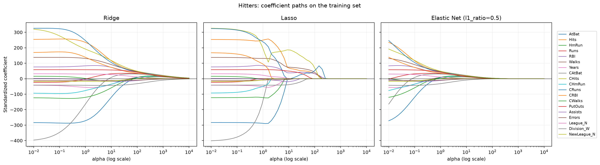

# 第三周作业：正则化回归

本周完成课件第 9.3 节作业 1、3、4。作业 4 的可复现代码是 [第三周正则化回归比较.py](第三周正则化回归比较.py)，结果表见 [第三周模型比较结果.csv](第三周模型比较结果.csv)，系数路径图见 [第三周系数路径.png](第三周系数路径.png)。

## 作业 1：正交设计下 Ridge 与 OLS 的关系

采用课件中的 Ridge 目标函数

$$\min_{\boldsymbol\beta}\;\|\mathbf y-X\boldsymbol\beta\|_2^2+\lambda\|\boldsymbol\beta\|_2^2,$$

其一阶条件为

$$-2X^T(\mathbf y-X\widehat{\boldsymbol\beta}_{R})+2\lambda\widehat{\boldsymbol\beta}_{R}=0,$$

因此

$$\widehat{\boldsymbol\beta}_{R}=(X^TX+\lambda I)^{-1}X^T\mathbf y.$$

若设计矩阵满足 $X^TX=I$，则

$$\widehat{\boldsymbol\beta}_{R}=(I+\lambda I)^{-1}X^T\mathbf y
=\frac{1}{1+\lambda}X^T\mathbf y.$$

同一正交设计下，OLS 解为 $\widehat{\boldsymbol\beta}_{OLS}=(X^TX)^{-1}X^T\mathbf y=X^T\mathbf y$，所以

$$\boxed{\widehat{\boldsymbol\beta}_{R}=\frac{1}{1+\lambda}\widehat{\boldsymbol\beta}_{OLS}}.$$

$\lambda>0$ 时每个系数都按同一比例向 0 收缩；$\lambda=0$ 时回到 OLS。该结论采用“惩罚项为 $\lambda\|\beta\|_2^2$”的参数化，并假定参与惩罚的系数都满足题设。若模型含有不受惩罚的截距，应把结论理解为对斜率系数成立。

## 作业 3：为什么正则化前要做 Z-score 标准化

Ridge 与 Lasso 对系数大小施加惩罚，但系数的数值取决于预测变量的计量单位。若把某个预测变量改成原单位的 $c$ 倍，为保持预测不变，它的系数会缩小为原来的 $1/c$；于是同一组数据只因单位改变，$\beta_j^2$ 或 $|\beta_j|$ 惩罚就会改变。不同尺度的变量因此会受到不公平的收缩，模型也可能主要按量纲而非预测信息选择变量。

Z-score 将每个预测变量变为均值 0、标准差 1，使惩罚可以在可比尺度上作用。若不标准化，量纲大、数值范围宽的变量可能以较小系数承担较少惩罚；量纲小的变量则可能被过度压缩。实现时应先划分训练集，再只用训练集估计均值和标准差，并把同一转换应用到测试集，避免测试信息进入建模流程。截距通常不参与正则化。

## 作业 4：Hitters 上比较 Ridge、Lasso 与 Elastic Net

### 数据与方法

使用 ISLP 的 Hitters 棒球薪资数据；目标变量 `Salary` 是 1987 年球员年薪（千美元）。数据共 322 行，其中 59 行的 Salary 缺失，删除后得到 263 条完整记录。[ISLP 数据说明](https://intro-stat-learning.github.io/ISLP/datasets/Hitters.html)；本地数据文件为 [Hitters.csv](Hitters.csv)。

使用固定随机种子 2026，将有效记录按 75%/25% 分为训练集与测试集。训练集上进行 10 折交叉验证，分别用 `RidgeCV`、`LassoCV`、`ElasticNetCV` 选择惩罚强度；Elastic Net 同时搜索 `l1_ratio`。数值变量做 Z-score，分类变量做独热编码，预处理只在训练集拟合。系数路径由训练集拟合得到，测试集只用于最终 RMSE 评价。

### 结果

| 模型 | 交叉验证选择的 α | l1_ratio | 测试 RMSE（千美元） | 非零特征数 |
|---|---:|---:|---:|---:|
| RidgeCV | 137.7972 | — | 413.4200 | 19 |
| LassoCV | 11.9110 | — | 417.2132 | 9 |
| ElasticNetCV | 7.9202 | 0.990 | **411.0187** | 12 |
| Elastic Net 1-SE | 91.6274 | 1.000 | 438.3358 | **5** |

三种 CV 最优模型的测试 RMSE 都在 411–417 千美元之间。当前固定划分中，ElasticNetCV 的 RMSE 最低；Lasso 使用 9 个非零特征，较 Ridge 的 19 个更稀疏，测试 RMSE 高约 3.8 千美元。ElasticNetCV 选择的 `l1_ratio=0.99` 接近 Lasso，说明这组数据的预测解偏稀疏。

1-SE 结果从 Elastic Net 的 10 折 CV 网格中选择平均 MSE 不超过“最小 CV MSE + 1 个标准误”的候选，并在其中选非零特征较少的模型。最小 CV MSE 为 104209.544，标准误为 16926.017；1-SE 选择落在 `l1_ratio=1` 的 Lasso 边界，保留 5 个非零特征。它比 ElasticNetCV 最优点更稀疏，但测试 RMSE 增加约 27.3 千美元。若更重视变量精简，可接受这部分预测误差时选择 1-SE；若预测误差优先，则这次划分支持 ElasticNetCV 最优点。该取舍是基于一次固定测试划分，换随机划分后数值可能变化。



## 运行方式

在仓库根目录安装项目依赖后运行：

```powershell
.\.venv\Scripts\python.exe "第三四周作业\第三周正则化回归比较.py"
```

脚本使用目录内的 `Hitters.csv`，会重建模型比较 CSV 与 PNG 图。
