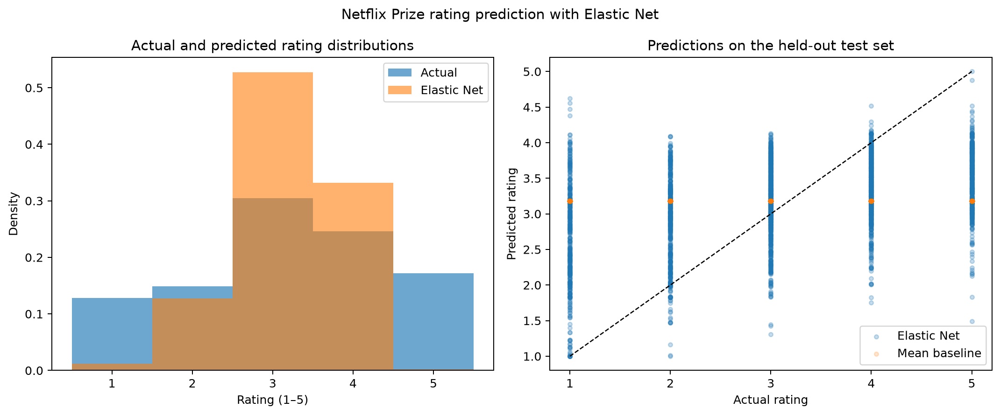

# 第四周作业：Netflix Prize 评分的 Elastic Net 分析

本作业以 Elastic Net 回归预测 Netflix 用户对电影的 1–5 星评分。可复现代码见 [第四周Netflix_ElasticNet.py](第四周Netflix_ElasticNet.py)，结果表见 [第四周Netflix模型结果.csv](第四周Netflix模型结果.csv)，评估图见 [第四周NetflixElasticNet评估.png](第四周NetflixElasticNet评估.png)。

## 数据来源与抽样

使用 Kaggle 的 [Netflix Prize data 数据卡](https://www.kaggle.com/netflix-inc/netflix-prize-data/data)。数据卡描述了 17,770 部电影、约 480,189 名用户、1–5 星整数评分及评分日期；数据卡提供的原始数据包下载地址指向 [Internet Archive](https://archive.org/download/nf_prize_dataset.tar/nf_prize_dataset.tar.gz)。

完整压缩包约 698 MB，未提交到 Git。脚本在本机 `第三四周作业/data/` 缓存压缩包和抽样文件；该目录已加入 `.gitignore`。为了控制课程作业的运行成本，固定随机种子 2026，从全片库随机选择 150 个电影 ID，再对每部电影最多蓄水池抽样 100 条评分。部分电影的评分不足 100 条，最终样本为 14,727 条，覆盖 150 部电影和 12,692 名用户。样本平均评分为 3.180，评分日期从 2000-01-07 至 2005-12-31。

样本评分分布：

| 星级 | 条数 | 星级 | 条数 |
|---:|---:|---:|---:|
| 1 | 1,890 | 4 | 3,636 |
| 2 | 2,237 | 5 | 2,517 |
| 3 | 4,447 |  |  |

## 方法

预测变量包括 `user_id`、`movie_id`、评分年份和月份。用户与电影 ID 作为类别变量独热编码，年份和月份标准化。按 80%/20% 划分训练集和测试集，随机种子为 2026；在训练集内使用 5 折交叉验证搜索 Elastic Net 的 `alpha` 与 `l1_ratio`。预处理器放在交叉验证 Pipeline 内，每一折只在该折的训练部分拟合。最终预测截断在 1–5 星范围内，并与训练集均值基线比较。

## 结果与解释

| 模型 | CV RMSE | 测试 RMSE | 测试 MAE | 测试 $R^2$ |
|---|---:|---:|---:|---:|
| 训练集均值基线 | — | 1.2501 | 1.0252 | 0.0000 |
| Elastic Net | 1.0907 | **1.1047** | **0.8792** | **0.2190** |

交叉验证选择的参数为 $\alpha=0.0001778$、`l1_ratio=0.10`。Elastic Net 在留出的测试集上比均值基线的 RMSE 低约 11.6%，MAE 低约 14.2%；测试 $R^2=0.219$，说明这个抽样测试集中的评分差异仍有较大部分无法由当前特征解释。模型保留了 8,773 个非零特征，低 `l1_ratio` 与较多非零系数表明本次最优解更偏向 Ridge 式的平滑收缩，而非强稀疏筛选。



## 结论与局限

在本次固定抽样和随机划分上，Elastic Net 优于只预测训练集平均分的基线，可利用用户、电影及评分时间特征改善评分预测。不过，模型把用户和电影贡献作为加性效应，没有建模特定用户与特定电影之间的潜在交互；这与 SVD 课件强调的低秩隐因子思路不同。后续可用矩阵分解模型对照。

本结果只适用于“150 部随机电影、每部最多 100 条评分”的平衡抽样，不代表原始 1 亿条评分的总体误差。随机按评分记录切分时，同一用户或电影可能同时出现在训练集和测试集，因此评价的是已知用户/电影的评分补全表现，不是新用户或新电影的冷启动表现。原始数据许可标为其他条款，仓库只保存数据来源说明和聚合结果，不分发原始包或评分样本。

## 运行方式

从仓库根目录运行：

```powershell
.\.venv\Scripts\python.exe "第三四周作业\第四周Netflix_ElasticNet.py"
```

首次运行会从上面的来源地址下载压缩包并抽样；之后可复用本地缓存。需要重新抽样时运行：

```powershell
.\.venv\Scripts\python.exe "第三四周作业\第四周Netflix_ElasticNet.py" --refresh-sample
```
